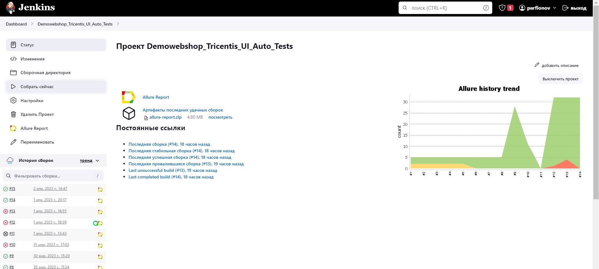

TODO: Проект будет развиваться, дополняться, усложняться.
## Проект по тестированию демонстрационного интернет-магазина "Tricentis"
> <a target="_blank" href="https://demowebshop.tricentis.com/">Ссылка на интернет-магазин</a>

## Проект реализован с использованием
Java11, Gradle, IntelliJ IDEA, Selenide, Selenoid, JUnit5, Jenkins, Allure Report, Allure TestOps, Jira

## Запуск автотестов выполняется на локальном сервере Jenkins

### Параметры сборки
#### Конфиденциальные данные размещены в файлах properties и вызываются в настройках Jenkins
####Локальный запуск: gradle clean test -DlocalOrRemote=local
####Удаленный запуск: gradle clean test -DlocalOrRemote=remote

## Настроена интеграция с Allure Report

### Пример видеозаписи прохождения теста

## Настроена интеграция с Allure TestOps

## Результаты выполнения тестов интегрированы с Atlassian Jira

## Откорректированный тест, сгенерированный ChatGpt
TODO: эксперимент считаю удачным, необходимы дальнейшие исследования.

